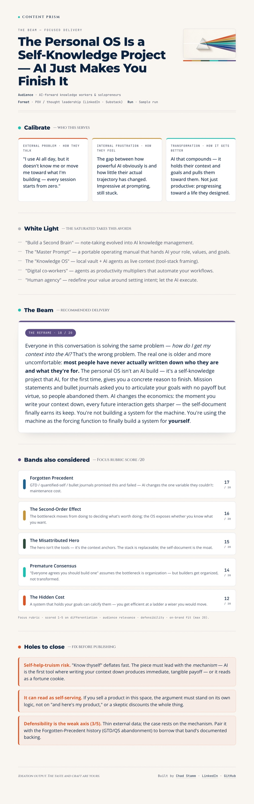

# Content Prism 🔱

*You bring the idea. The Prism finds the angle nobody's running — and punches holes in it before you write.*

A [Claude](https://claude.com) **Agent Skill** that takes an idea and refuses to deliver it the obvious way.

Most AI ideation drops your idea straight into the "red ocean" — the same framings everyone already uses, because everyone starts in the same place. Content Prism starts at the opposite end.

Think of your idea as a beam of **white light** — it looks like everyone else's, all the takes blurred into the same indistinct thing. The Prism splits it into a **spectrum** of distinct, differentiated angles, pressure-tests each one, and focuses down to a single defensible **beam**: the sharpest way to deliver *your* idea.

> **This is an ideation and stress-test tool, not a drafting tool.** It finds the angle and tells you where it's weak. Turning that into great content still takes your taste and craft.

---

## What you get

Every run ends in a styled, self-contained **Beam** — the recommended angle, the runners-up scored, and the holes named, with Save-as-PDF, Markdown export, and Share built in:



## What it does

Two moves, always in order:

1. **Diverge** — split the idea open. Map what everyone's already saying, then break it into angles they're *not*.
2. **Converge** — focus. Pressure-test the angles, drop the ones that don't hold, narrow to the one worth writing.

The full flow:

```
CALIBRATE → WHITE LIGHT → SPECTRUM → PUNCH HOLES → FOCUS → THE BEAM
```

| Step | What happens |
|------|--------------|
| **CALIBRATE** | Ground the idea in three audience truths: external problem, internal frustration, transformation. |
| **WHITE LIGHT** | Map the 3–5 most saturated framings already out there. You can't differentiate from what you haven't mapped. |
| **SPECTRUM** | Split the idea into fresh angles using six universal lenses. Breadth first — no quality control yet. |
| **PUNCH HOLES** | Switch to adversarial mode. Find where each angle breaks before a smart reader does. |
| **FOCUS** | Score every surviving angle (differentiation · audience relevance · defensibility · on-brand fit) and rank them. |
| **THE BEAM** | Auto-render the top-scored angle as a styled one-page HTML brief — with the runners-up and the holes baked in. |

### The six lenses

Each one bends your idea away from the saturated framing by asking a different question:

1. **The Hidden Cost** — everyone's celebrating the upside; what's the unpriced downside?
2. **The Second-Order Effect** — everyone's discussing the direct effect; what happens two steps out?
3. **The Misattributed Hero** — the narrative credits X; is it actually Y?
4. **The Premature Consensus** — everyone "agrees"; but is it actually settled?
5. **The Forgotten Precedent** — everyone's treating this as new; when did it happen before?
6. **The Reframe** — everyone's solving the stated problem; is the problem itself mislabeled?

The lenses live in [`references/angle-categories.md`](references/angle-categories.md) — edit, cut, or add your own.

---

## Install

Content Prism is an Agent Skill. Drop it where your Claude reads skills:

```bash
git clone https://github.com/chadstamm/content-prism.git ~/.claude/skills/content-prism
```

Works anywhere Claude loads skills from `~/.claude/skills/` (Claude Code, and Claude apps with Skills enabled). No build step, no dependencies.

## Use it

You don't type a command — you just talk to it. Claude matches your phrasing to the skill and it fires:

- *"Run this idea through the prism: [your idea]"*
- *"Punch holes in this angle before I write it."*
- *"Everyone's saying the same thing about [topic] — help me find a fresher take."*

The Beam opens in your browser automatically. Want sourced stats and citations to draft from? Ask for the full brief (`--brief`).

See [`examples/sample-beam.html`](examples/sample-beam.html) for a rendered output.

---

## What it's for (scope)

The Prism works on ideas that have to **win attention in a crowded conversation** — POV and thought leadership (LinkedIn, Substack, newsletters), company and client content, launch narratives, talk and podcast angles.

It is **not** for fiction, memoir, personal narrative, journaling, or technical docs. Those are about truth and craft, not differentiation from competitors — and the skill will tell you so and decline.

## Integrity rules (baked in)

- Never fabricates a stat, quote, or source.
- Maps the saturated takes *before* it splits — no fake contrarianism.
- Always surfaces where the chosen angle is weak. Holes are a feature.

---

## Credit

Built by [Chad Stamm](https://chadstamm.com) · [LinkedIn](https://www.linkedin.com/in/chadstamm) · [Bluesky](https://bsky.app/profile/chadstamm.bsky.social)

If it sharpens something you ship, I'd love to hear about it.

## License

[MIT](LICENSE) — use it, fork it, tune the lenses to your own point of view.
